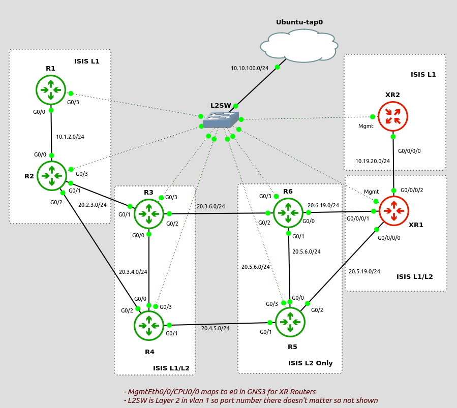

# Ansible Playbook Solutions to INE Service Provider Workbook v3

#### Tasks Completed so far

- IPv4, IPv6 interface configurations
- Task 2.1 - OSPF base configuration
- Task 2.2 - OSPF Network Types
- Task 2.3 - OSPF Path Selection
- Task 2.5 - OSPF Authentication
- Task 2.6 - OSPFv3 Base Configurations
- Task 2.7 - OSPFv3 Path Selection

- Task 2.11 - Base ISIS Configurations
- Task 2.12 - ISIS Network Types
- Task 2.13 - Missing
- Task 2.14 - Missed, BFD - issues with GNS3
- Task 2.15 - Skipped for now - ISIS Authentication
- Task 2.16 - Multi Level ISIS
- Task 2.17 - Route Leaking
- Task 2.18 - Single Topology ISIS

- Task 3.1 -   Basic LDP
- Task 3.2,3 - MPLS Autoconfig
- Task 3.4 -   LDP Authentication

- Task 4.1 -  Basic MPLS Tunnels

Interested in learning Ansible basics, I also host a course at Udemy, you can get it for only 9.99 - https://www.udemy.com/course/complete-ansible-for-network-engineers-ios-junos-arista/?couponCode=CC34A1D83FF673D22E2C
Msg me on linkedin if you need a free coupon.
