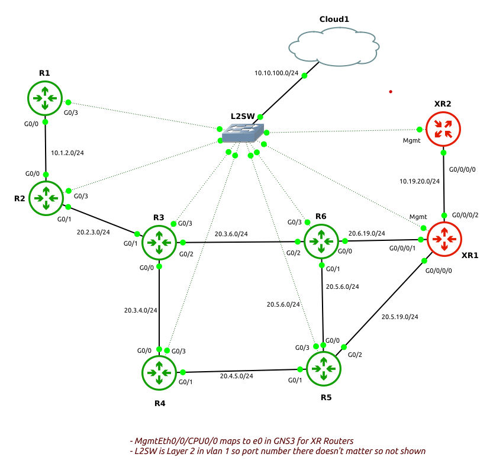

# Ansible Playbook Solutions to INE Service Provider Workbook v3

## Introduction

This repository provides solutions to tasks in INE Service Provider Workbook v3 in Ansible Playbooks form. Instead of using CLI, ansible is used to complete the tasks. Jinja2 templates are used and configurations are achieved by changing host files wherever possible.

### Network Diagram



## Installation

```
git clone https://github.com/shahzadqadir/ccie_sp_workbook_ansible.git
```
